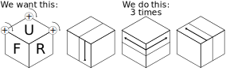
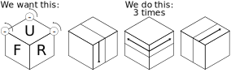
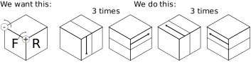

---
title: Rubik cube solving
...

1. Adjacent vertex exchange

2. Triple vertex exchange forward

3. Triple vertex exchange backward

4. Triple corner rotate forward

5. Triple corner rotate backward

6. Double corner rotate

