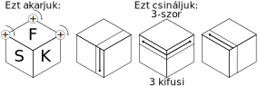
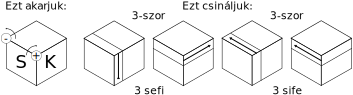

---
title: Rubik kocka rendezése
...

1. Szomszédos sarkok cseréje

2. Hármas sarokcsere előre

3. Hármas sarokcsere visszafelé

4. Sarkok elcsavarása előre

5. Sarkok elcsavarása visszafelé

6. Két sarok elcsavarása

7. Hármas élcsere előre

8. Hármas élcsere visszafelé

9. Két él megfordítása vízszintes helyzetben

10. Két él megfordítása függőleges helyzetben

